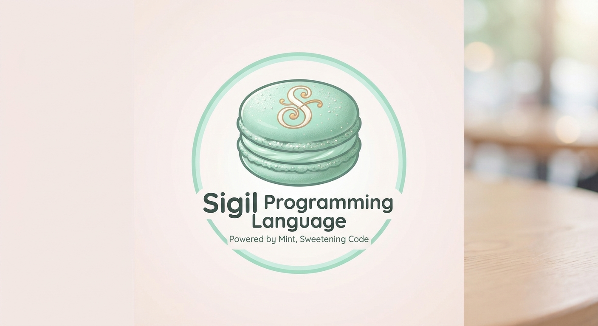

<div align="center">
  
</div>

# Sigil

**人間に代わって AI がコーディングするための開発言語。**

Sigil（シジル）は、Java・React・Node.js に代わる言語を目指して開発する、AI 専用の汎用プログラミング言語です。コードは AI が書き、AI が保守します。人間は **仕様だけ** をレビューします。

プログラムの「約束」を、「保証」に変える言語 — Sigil。

Sigil で作るプログラムは、動き出す前に「自分は何をするか」を約束として書き出します。ファイルを読む、外部と通信する、秘密情報を扱う — ぜんぶ、最初に正直に書く。そしてコンパイラが、その約束と実際の動きが完全に一致していることを確かめます。約束は、コンパイラの確認を通った時点で保証になります。約束にないことは、プログラムにはできません。

Sigil は、AI がプログラムを作る時代のために生まれた言語です。AI がどれだけ速く、たくさん書いても、出来上がるのは保証付きのプログラムだけです。

だから、安心して AI と一緒に作れます。任せても、約束は破られない。確かめるのは、保証の一覧だけ。AI の速さを力に変える、新しい「作るワクワク」が始まります。

## 特徴

- **仕様を一級の構文で書く**: すべての関数は、意図（`intent`）、事前条件（`requires`）、事後条件（`ensures`）、効果（`effects`）を宣言します。
- **宣言と推論の完全一致**: コンパイラがコードから推論した効果と、宣言された効果が完全に一致しなければエラーになります。宣言にない効果は、プログラムには起こせません。
- **情報フローを型で追う**: 秘密情報は `Secret` 型で扱い、表示や出力に使える型とは区別します。漏れる経路は型の段階で閉じられます。
- **機械が読める仕様と診断**: `sigil spec` で仕様を、`sigil check --json` で診断を JSON で取り出せます。言語サーバー（`sigil lsp`）も同じ検査を使います。

## コード例

`examples/04-effects` から抜粋します。

```sigil
// 効果なし: 純粋な計算。
fn add_tax(price: Int, rate_percent: Int) -> Int
  intent "税込み価格を返す"
  requires price >= 0 && rate_percent >= 0
  ensures result >= price
  effects none
{
  return price + price * rate_percent / 100;
}

// 効果あり: ファイルを読み、ログを出す。
fn load_prices(path: Path) -> Result<List<Int>, IoError>
  intent "価格の一覧をファイルから読む"
  requires !path.is_empty()
  ensures none
  effects console, fs.read
{
  console.log(&"loading prices");
  let text = fs.read(&path)?;
  return Ok(text.lines().map(|line| line.parse_int().unwrap_or(0)));
}
```

`load_prices` が宣言している効果は `console` と `fs.read` だけです。本体がネットワーク通信など別の効果を起こそうとすれば、コンパイラが一致しないことを指摘します。

サンプルは [examples/](examples/) に 9 つあります（平均値、所有権、効果、並行処理、トレイト、列挙型など）。

## はじめかた

処理系は Rust で書かれています。ソースからビルドします。

```bash
git clone https://github.com/goodnasubi/sigil
cd sigil
cargo build --release
# 実行ファイルは target/release/sigil
```

小さなプログラムで試せます。ファイル名とモジュール名は対応させます（`hello.sigil` には `module hello`）。

```sigil
module hello
  targets server
  trust none

fn greet() -> Int
  intent "挨拶として 42 を返す"
  requires none
  ensures result == 42
  effects none
{
  return 42;
}
```

```bash
sigil check hello.sigil   # 検査する
sigil run hello.sigil greet  # 実行すると 42 が表示される
```

## ステータス

言語の核（P0）は完了しています。構文解析・整形（`sigil fmt`）、型と効果と所有権の検査、仕様の表示（`sigil spec`）、SIR 評価器による実行（`sigil run`）、Cranelift によるネイティブ出力（`sigil build`）、言語サーバーが動きます。

現在は P1（サーバー向けの実用化）と、標準ライブラリを Sigil 自身で書き直して Rust 製ランタイムへの依存を無くす作業（段階3）を進めています。設計判断の記録は [docs/decisions/](docs/decisions/) の ADR にあります。

## 目標

- **AI が書き手**: 人間の書きやすさではなく、AI が意図を曖昧さなく表現でき、誤りを機械的に検出できることを優先します。
- **人間は仕様だけを見る**: 意図・事前条件・事後条件・効果をコードから取り出して人間に示し、コードがそれを満たすことを処理系が検証します。
- **フロントエンドからバックエンドまで 1 言語**: ブラウザの UI、サーバー、その間の通信を同じ言語で書きます。
- **独自の実行方式**: コンパイラと実行環境を独自に作ります。サーバー向けにはネイティブコード、ブラウザ向けには WebAssembly と JavaScript を出力する想定です。
- **Python から呼び出せる**: Sigil で書いた関数・型を Python から呼び出せるようにします。
- **Rust と同等のメモリ安全性**: 解放後の使用・ヌル参照・データ競合などのメモリ不具合を、コンパイル時に排除します。

## 長期目標

最終的には、Sigil で次のものを置き換えられるようにすることを目指します（[ADR 0005](docs/decisions/0005-long-term-goals.md)）。

| 段階 | 内容 |
|---|---|
| P0 | 言語の核（コンパイラ・検査・仕様の表示・標準ライブラリの最小部分・言語サーバー）。**完了** |
| P1 | サーバーと Docker コンテナでのリリース |
| P2 | Web フルスタックと IDE |
| P3 | Python の置き換えと Python 連携 |
| P4 | データベース・リポジトリ管理 |
| P5 | コンテナ管理 |
| P6 | OS |
| P7 | ブラウザ（P3〜P6 と並行して進められる） |

置き換えの対象は、Next.js や Spring のようなフレームワーク、Python、データベース、Git、コンテナ基盤、OS、IDE、Web ブラウザです。

## 設計の柱

1. **仕様の明示**: 関数や単位ごとに、意図・前提・事後条件・効果を一級の構文として書く。
2. **機械的検証**: 型・所有権・契約・効果の検査で、誤りを実行前に検出する。
3. **決定的な表現**: 同じ意味を複数の書き方で表せないようにする（正規化可能な構文）。
4. **人間の可読性より検証可能性**: 人間が読むのは仕様であり、コード本体の読みやすさは優先しない。

詳細は [docs/DESIGN.md](docs/DESIGN.md)、安全設計の原則は [ADR 0027](docs/decisions/0027-ai-era-security-design-principles.md) を参照してください。

## リポジトリ構成

```
.
├── src/          コンパイラ本体（字句・構文・検査・コード生成・LSP）
├── runtime/      ランタイム（core / os）
├── examples/     サンプルプログラム
├── tests/        テスト
├── docs/         設計文書と ADR（docs/decisions/）
└── scripts/      開発用スクリプト
```

## 開発に参加する

Issue と Pull Request で開発しています。AI エージェントが作業するときのルールは [AGENTS.md](AGENTS.md) にあります。

## ライセンス

MIT License。詳細は [LICENSE](LICENSE) を参照してください。
